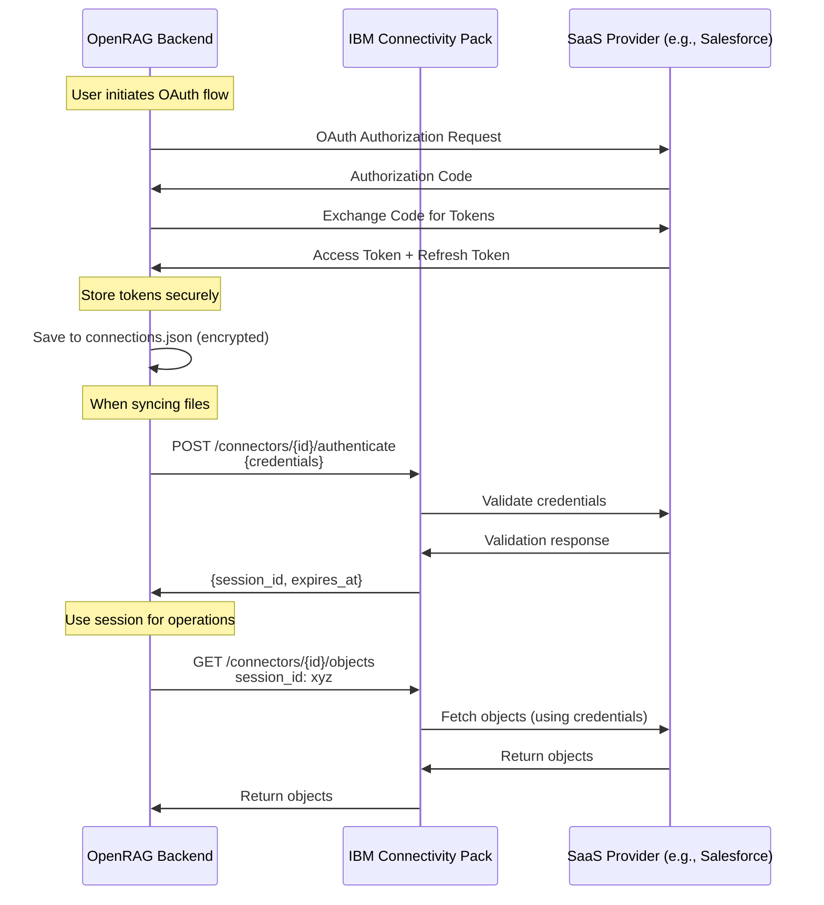
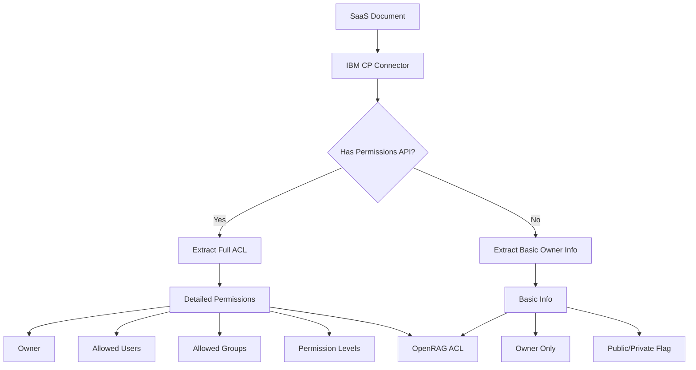

# IBM Connectivity Pack - Authentication & ACL Clarification

## Authentication & Credential Management

### How Authentication Works

IBM Connectivity Pack follows a **session-based authentication model** where:

1. **Credentials are stored in OpenRAG** (not in IBM CP)
2. **IBM CP validates credentials** and returns a session token
3. **Session tokens are used** for subsequent API calls



### Credential Storage Architecture

#### Current OpenRAG Pattern (Maintained)

OpenRAG already has a secure credential storage system that will continue to be used:

```python
# Location: data/connections.json (encrypted at rest)
{
    "connections": [
        {
            "connection_id": "uuid-123",
            "connector_type": "ibm_cp_salesforce",
            "name": "My Salesforce",
            "config": {
                "connector_id": "salesforce",
                "credentials": {
                    "access_token": "encrypted_token_here",
                    "refresh_token": "encrypted_refresh_token",
                    "client_id": "salesforce_client_id",
                    "client_secret": "encrypted_secret",
                    "instance_url": "https://mycompany.salesforce.com"
                },
                "token_file": "keys/ibm_cp_salesforce_uuid-123.json"
            },
            "user_id": "user-456",
            "is_active": true
        }
    ]
}
```

#### Token File Storage (Per Connection)

For OAuth-based connectors, tokens are stored in separate encrypted files:

```python
# Location: keys/ibm_cp_salesforce_uuid-123.json
{
    "access_token": "ya29.a0AfH6SMBx...",
    "refresh_token": "1//0gHdP9...",
    "token_type": "Bearer",
    "expires_at": "2024-12-31T23:59:59Z",
    "scopes": ["https://www.googleapis.com/auth/drive.readonly"]
}
```

**Security Features**:
- Files stored in `keys/` directory (excluded from git)
- Encrypted at rest using Fernet encryption
- Per-user, per-connection isolation
- Automatic token refresh before expiry

### Authentication Flow Details

#### 1. Initial OAuth Setup (User-Initiated)

```python
# src/connectors/ibm_connectivity_pack/oauth_handler.py

class IBMCPOAuthHandler:
    """
    Handles OAuth flows for IBM CP connectors.
    Reuses OpenRAG's existing OAuth infrastructure.
    """
    
    async def initiate_oauth_flow(
        self,
        connector_id: str,
        user_id: str,
        redirect_uri: str
    ) -> str:
        """
        Start OAuth flow for an IBM CP connector.
        
        Steps:
        1. Get OAuth config from IBM CP discovery API
        2. Generate state token for CSRF protection
        3. Build authorization URL
        4. Return URL for user redirect
        
        Returns:
            Authorization URL for user to visit
        """
        # Get OAuth configuration from IBM CP
        cred_schema = await self.ibm_cp_client.get_credential_schema(connector_id)
        oauth_config = cred_schema.get("oauth_config", {})
        
        # Build authorization URL
        auth_url = oauth_config["authorization_url"]
        params = {
            "client_id": oauth_config["client_id"],
            "redirect_uri": redirect_uri,
            "response_type": "code",
            "scope": " ".join(oauth_config["scopes"]),
            "state": self._generate_state_token(user_id, connector_id)
        }
        
        return f"{auth_url}?{urlencode(params)}"
    
    async def handle_oauth_callback(
        self,
        connector_id: str,
        code: str,
        state: str
    ) -> Dict[str, Any]:
        """
        Handle OAuth callback and exchange code for tokens.
        
        Steps:
        1. Validate state token
        2. Exchange authorization code for tokens
        3. Store tokens securely
        4. Create connection in ConnectionManager
        
        Returns:
            Connection configuration
        """
        # Validate state
        user_id, connector_id_from_state = self._validate_state_token(state)
        
        # Get OAuth config
        cred_schema = await self.ibm_cp_client.get_credential_schema(connector_id)
        oauth_config = cred_schema.get("oauth_config", {})
        
        # Exchange code for tokens
        token_response = await self._exchange_code_for_tokens(
            token_url=oauth_config["token_url"],
            code=code,
            client_id=oauth_config["client_id"],
            client_secret=oauth_config["client_secret"],
            redirect_uri=oauth_config["redirect_uri"]
        )
        
        # Store tokens securely
        connection_id = str(uuid.uuid4())
        token_file = f"keys/ibm_cp_{connector_id}_{connection_id}.json"
        
        await self._store_tokens_encrypted(token_file, token_response)
        
        # Create connection
        connection_config = {
            "connector_id": connector_id,
            "credentials": {
                "token_file": token_file,
                "client_id": oauth_config["client_id"],
                "client_secret": oauth_config["client_secret"]
            }
        }
        
        return connection_config
```

#### 2. Session Management (Automatic)

```python
# src/connectors/ibm_connectivity_pack/adapter.py

class IBMCPAdapter(BaseConnector):
    
    async def authenticate(self) -> bool:
        """
        Authenticate with IBM CP using stored credentials.
        
        Flow:
        1. Load credentials from token file
        2. Check if access token is still valid
        3. Refresh token if expired
        4. Send credentials to IBM CP for validation
        5. Receive session_id from IBM CP
        6. Cache session_id for subsequent requests
        """
        # Load credentials
        credentials = await self._load_credentials()
        
        # Refresh token if needed
        if self._is_token_expired(credentials):
            credentials = await self._refresh_access_token(credentials)
            await self._save_credentials(credentials)
        
        # Authenticate with IBM CP
        auth_result = await self.client.authenticate_connector(
            connector_id=self.connector_id,
            credentials={
                "access_token": credentials["access_token"],
                "token_type": credentials.get("token_type", "Bearer")
            }
        )
        
        # Store session info
        self.session_id = auth_result["session_id"]
        self.session_expires_at = datetime.fromisoformat(auth_result["expires_at"])
        self._authenticated = True
        
        return True
    
    async def _load_credentials(self) -> Dict[str, Any]:
        """Load and decrypt credentials from token file"""
        token_file = self.config.get("credentials", {}).get("token_file")
        if not token_file:
            raise ValueError("No token file configured")
        
        # Use OpenRAG's encryption utilities
        from utils.encryption import decrypt_file
        
        encrypted_data = Path(token_file).read_bytes()
        decrypted_data = decrypt_file(encrypted_data)
        return json.loads(decrypted_data)
    
    async def _refresh_access_token(
        self,
        credentials: Dict[str, Any]
    ) -> Dict[str, Any]:
        """
        Refresh expired access token using refresh token.
        
        This is handled by IBM CP's token refresh endpoint.
        """
        refresh_result = await self.client.refresh_token(
            connector_id=self.connector_id,
            refresh_token=credentials["refresh_token"],
            client_id=self.config["credentials"]["client_id"],
            client_secret=self.config["credentials"]["client_secret"]
        )
        
        # Update credentials with new tokens
        credentials["access_token"] = refresh_result["access_token"]
        credentials["expires_at"] = refresh_result["expires_at"]
        
        # Update refresh token if provided (some providers rotate it)
        if "refresh_token" in refresh_result:
            credentials["refresh_token"] = refresh_result["refresh_token"]
        
        return credentials
```

### Credential Security Best Practices

#### 1. Encryption at Rest

```python
# utils/encryption.py (existing OpenRAG utility)

from cryptography.fernet import Fernet
import os

class CredentialEncryption:
    """Handles encryption/decryption of sensitive credentials"""
    
    def __init__(self):
        # Load encryption key from environment or generate
        key = os.getenv("ENCRYPTION_KEY")
        if not key:
            key = Fernet.generate_key()
            logger.warning("No ENCRYPTION_KEY set, using generated key")
        
        self.cipher = Fernet(key)
    
    def encrypt(self, data: str) -> bytes:
        """Encrypt string data"""
        return self.cipher.encrypt(data.encode())
    
    def decrypt(self, encrypted_data: bytes) -> str:
        """Decrypt encrypted data"""
        return self.cipher.decrypt(encrypted_data).decode()

# Usage in adapter
encryption = CredentialEncryption()

async def _save_credentials(self, credentials: Dict[str, Any]):
    """Save credentials encrypted"""
    token_file = self.config["credentials"]["token_file"]
    
    # Encrypt credentials
    encrypted = encryption.encrypt(json.dumps(credentials))
    
    # Write to file
    Path(token_file).write_bytes(encrypted)
    
    # Set restrictive permissions (Unix only)
    os.chmod(token_file, 0o600)
```

#### 2. Environment Variables for Secrets

```bash
# .env file (never committed to git)

# Encryption key for credential storage
ENCRYPTION_KEY=your-base64-encoded-key-here

# IBM CP service URL
IBM_CP_URL=http://ibm-connectivity-pack:3000

# OAuth client credentials (if using centralized config)
SALESFORCE_CLIENT_ID=your-client-id
SALESFORCE_CLIENT_SECRET=your-client-secret

GOOGLE_DRIVE_CLIENT_ID=your-client-id
GOOGLE_DRIVE_CLIENT_SECRET=your-client-secret
```

#### 3. Secrets Management in Production

```python
# For production deployments, use secrets management services

class SecretsManager:
    """
    Abstract interface for secrets management.
    Implementations: AWS Secrets Manager, Azure Key Vault, HashiCorp Vault
    """
    
    async def get_secret(self, secret_name: str) -> str:
        """Retrieve secret from secrets manager"""
        pass
    
    async def store_secret(self, secret_name: str, secret_value: str):
        """Store secret in secrets manager"""
        pass

# AWS Secrets Manager implementation
class AWSSecretsManager(SecretsManager):
    def __init__(self):
        import boto3
        self.client = boto3.client('secretsmanager')
    
    async def get_secret(self, secret_name: str) -> str:
        response = self.client.get_secret_value(SecretId=secret_name)
        return response['SecretString']
```

---

## ACL (Access Control List) Support

### Does IBM Connectivity Pack Support ACL Extraction?

**Yes**, IBM Connectivity Pack supports ACL extraction through its **permissions model** in the object schema. However, the level of detail varies by connector.

### How ACL Works in IBM CP



### ACL Data Structure in IBM CP

When you fetch an object from IBM CP, the response includes a `permissions` field:

```json
{
    "id": "file123",
    "name": "document.pdf",
    "type": "Document",
    "owner": {
        "id": "user123",
        "email": "owner@example.com",
        "name": "John Doe"
    },
    "permissions": {
        "users": [
            {
                "email": "user1@example.com",
                "role": "reader",
                "type": "user"
            },
            {
                "email": "user2@example.com",
                "role": "writer",
                "type": "user"
            }
        ],
        "groups": [
            {
                "email": "team@example.com",
                "role": "reader",
                "type": "group"
            }
        ],
        "anyone": {
            "role": "none",
            "type": "anyone"
        },
        "domain": {
            "domain": "example.com",
            "role": "reader",
            "type": "domain"
        }
    },
    "metadata": {...}
}
```

### Mapping IBM CP Permissions to OpenRAG ACL

```python
# src/connectors/ibm_connectivity_pack/adapter.py

def _map_ibm_object_to_connector_document(
    self,
    obj: Dict[str, Any],
    content: bytes
) -> ConnectorDocument:
    """
    Map IBM CP object to OpenRAG ConnectorDocument with ACL.
    """
    # Extract permissions from IBM CP object
    permissions = obj.get("permissions", {})
    owner_info = obj.get("owner", {})
    
    # Build ACL
    acl = self._extract_acl_from_permissions(permissions, owner_info)
    
    return ConnectorDocument(
        id=obj["id"],
        filename=obj.get("name", "untitled"),
        mimetype=obj.get("mimeType", "application/octet-stream"),
        content=content,
        source_url=obj.get("webUrl", ""),
        acl=acl,  # ACL extracted from permissions
        modified_time=self._parse_datetime(obj.get("modifiedTime")),
        created_time=self._parse_datetime(obj.get("createdTime")),
        metadata=obj.get("metadata", {})
    )

def _extract_acl_from_permissions(
    self,
    permissions: Dict[str, Any],
    owner_info: Dict[str, Any]
) -> DocumentACL:
    """
    Extract OpenRAG ACL from IBM CP permissions structure.
    
    Handles:
    - User-level permissions
    - Group-level permissions
    - Domain-wide permissions
    - Public access
    """
    # Extract owner
    owner = owner_info.get("email") or owner_info.get("id")
    
    # Extract allowed users
    allowed_users = []
    for user_perm in permissions.get("users", []):
        if user_perm.get("email"):
            allowed_users.append(user_perm["email"])
    
    # Extract allowed groups
    allowed_groups = []
    for group_perm in permissions.get("groups", []):
        if group_perm.get("email"):
            allowed_groups.append(group_perm["email"])
    
    # Handle domain-wide access
    domain_perm = permissions.get("domain", {})
    if domain_perm.get("role") and domain_perm["role"] != "none":
        # Add domain as a group
        domain = domain_perm.get("domain")
        if domain:
            allowed_groups.append(f"@{domain}")
    
    # Handle public access
    anyone_perm = permissions.get("anyone", {})
    if anyone_perm.get("role") and anyone_perm["role"] != "none":
        # Add special marker for public access
        allowed_groups.append("@public")
    
    return DocumentACL(
        owner=owner,
        allowed_users=allowed_users,
        allowed_groups=allowed_groups
    )
```

### ACL Support by Connector Type

| Connector | Owner | Users | Groups | Domain | Public | Notes |
|-----------|-------|-------|--------|--------|--------|-------|
| Google Drive | ✅ | ✅ | ✅ | ✅ | ✅ | Full ACL support via Drive API |
| OneDrive | ✅ | ✅ | ✅ | ❌ | ✅ | Via Microsoft Graph permissions |
| SharePoint | ✅ | ✅ | ✅ | ✅ | ✅ | Full SharePoint permissions model |
| Salesforce | ✅ | ✅ | ✅ | ❌ | ❌ | Record-level sharing rules |
| Box | ✅ | ✅ | ✅ | ❌ | ✅ | Box collaboration API |
| Dropbox | ✅ | ✅ | ❌ | ❌ | ✅ | Shared folder members |
| IBM COS | ✅ | ✅ | ❌ | ❌ | ✅ | Bucket policies & ACLs |
| AWS S3 | ✅ | ✅ | ❌ | ❌ | ✅ | Bucket policies & ACLs |

### Handling Connectors with Limited ACL Support

For connectors that don't provide full ACL information:

```python
def _extract_acl_from_permissions(
    self,
    permissions: Dict[str, Any],
    owner_info: Dict[str, Any]
) -> DocumentACL:
    """
    Extract ACL with fallback for limited permission info.
    """
    owner = owner_info.get("email") or owner_info.get("id")
    
    # Try to extract full permissions
    allowed_users = self._extract_allowed_users(permissions)
    allowed_groups = self._extract_allowed_groups(permissions)
    
    # Fallback: If no permission info, assume owner-only access
    if not allowed_users and not allowed_groups:
        # Check if document is marked as public
        if permissions.get("is_public") or permissions.get("anyone", {}).get("role"):
            allowed_groups = ["@public"]
        else:
            # Owner-only access
            allowed_users = [owner] if owner else []
    
    return DocumentACL(
        owner=owner,
        allowed_users=allowed_users,
        allowed_groups=allowed_groups
    )
```

### ACL Synchronization

OpenRAG already has ACL update logic that will work seamlessly with IBM CP:

```python
# From src/connectors/service.py (existing code)

async def _update_connector_metadata(
    self,
    document: ConnectorDocument,
    owner_user_id: str,
    connector_type: str,
    jwt_token: str = None,
):
    """Update indexed chunks with connector-specific metadata"""
    from utils.acl_utils import update_document_acl
    
    # Get user's OpenSearch client
    opensearch_client = self.session_manager.get_user_opensearch_client(
        owner_user_id, jwt_token
    )
    
    # Update ACL if changed (hash-based skip optimization)
    acl_result = await update_document_acl(
        document_id=document.id,
        acl=document.acl,  # ACL from IBM CP
        opensearch_client=opensearch_client,
    )
    
    # Log ACL update result
    if acl_result["status"] == "updated":
        logger.info(
            f"Updated ACL for {document.id}, "
            f"{acl_result['chunks_updated']} chunks updated"
        )
```

### ACL Query Filtering in OpenSearch

When users search, OpenRAG filters results based on ACL:

```python
# From utils/acl_utils.py (existing code)

def build_acl_filter(user_email: str, user_groups: List[str]) -> Dict:
    """
    Build OpenSearch query filter for ACL-based access control.
    
    Returns documents where:
    - User is the owner, OR
    - User is in allowed_users, OR
    - User's group is in allowed_groups, OR
    - Document is public (@public in allowed_groups)
    """
    return {
        "bool": {
            "should": [
                {"term": {"owner": user_email}},
                {"term": {"allowed_users": user_email}},
                {"terms": {"allowed_groups": user_groups + ["@public"]}},
            ],
            "minimum_should_match": 1
        }
    }
```

---

## Summary

### Authentication & Credentials

1. **Credentials are stored in OpenRAG**, not in IBM CP
2. **Token files** are encrypted and stored per-connection in `keys/` directory
3. **IBM CP validates credentials** and returns session tokens for API calls
4. **Automatic token refresh** handled by the adapter before expiry
5. **Production deployments** should use secrets management services (AWS Secrets Manager, Azure Key Vault, etc.)

### ACL Support

1. **IBM CP provides ACL data** through the `permissions` field in object responses
2. **ACL detail varies by connector** - some provide full permissions, others only basic info
3. **OpenRAG's existing ACL system** works seamlessly with IBM CP-extracted permissions
4. **Fallback handling** for connectors with limited ACL support
5. **Search filtering** automatically respects ACL permissions in OpenSearch queries

### Key Advantages

- **Centralized credential management** in OpenRAG (single source of truth)
- **Secure storage** with encryption at rest
- **Automatic token refresh** prevents authentication failures
- **Consistent ACL model** across all connectors
- **Backward compatible** with existing OpenRAG security model