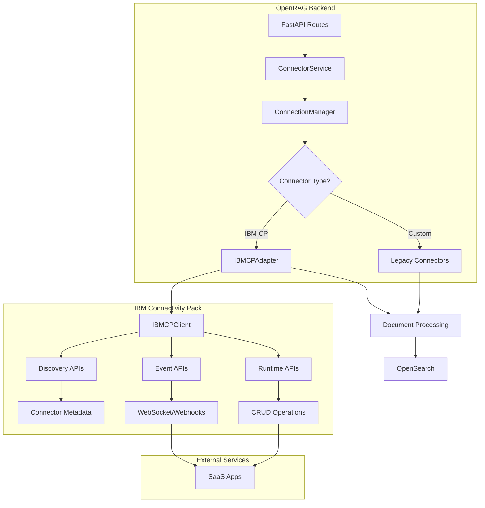

# IBM Connectivity Pack Integration - Technical Specification

## Overview

This document provides detailed technical specifications for integrating IBM Connectivity Pack with OpenRAG's connector system. The integration will replace custom-built connectors with IBM's 140+ pre-built connectors while maintaining backward compatibility and all existing functionality.

## Architecture Overview



## Component Specifications

### 1. IBM Connectivity Pack Client (`IBMCPClient`)

**Location**: `src/connectors/ibm_connectivity_pack/client.py`

**Purpose**: Low-level HTTP client for IBM Connectivity Pack APIs

#### 1.1 Class Definition

```python
from typing import Dict, List, Optional, Any
import aiohttp
from dataclasses import dataclass
from utils.logging_config import get_logger

logger = get_logger(__name__)

@dataclass
class IBMCPConfig:
    """Configuration for IBM Connectivity Pack client"""
    base_url: str
    timeout: int = 30
    max_retries: int = 3
    retry_delay: float = 1.0

class IBMCPClient:
    """
    Async HTTP client for IBM Connectivity Pack APIs.
    
    Provides methods for:
    - Discovery APIs: Connector metadata, schemas, capabilities
    - Runtime APIs: CRUD operations on connector objects
    - Event APIs: Webhook subscriptions and event handling
    """
    
    def __init__(self, config: IBMCPConfig):
        self.config = config
        self.session: Optional[aiohttp.ClientSession] = None
        self._connector_cache: Dict[str, Dict] = {}
```

#### 1.2 Discovery API Methods

```python
async def list_connectors(self) -> List[Dict[str, Any]]:
    """
    Get list of all available connectors.
    
    Returns:
        List of connector metadata:
        [
            {
                "id": "salesforce",
                "name": "Salesforce",
                "description": "Salesforce CRM connector",
                "icon": "https://...",
                "version": "1.0.0",
                "type": "action|event",
                "categories": ["crm", "sales"]
            },
            ...
        ]
    
    Raises:
        IBMCPConnectionError: If unable to connect to IBM CP
        IBMCPAPIError: If API returns error response
    """
    endpoint = f"{self.config.base_url}/api/connectors"
    # Implementation details...

async def get_connector_metadata(
    self, 
    connector_id: str,
    use_cache: bool = True
) -> Dict[str, Any]:
    """
    Get detailed metadata for a specific connector.
    
    Args:
        connector_id: Connector identifier (e.g., "salesforce")
        use_cache: Whether to use cached metadata
    
    Returns:
        {
            "id": "salesforce",
            "name": "Salesforce",
            "description": "...",
            "icon": "https://...",
            "credential_schema": {...},
            "objects": [
                {
                    "type": "Document",
                    "operations": ["create", "read", "update", "delete"],
                    "fields": [...]
                }
            ],
            "interactions": [...],
            "capabilities": {
                "supports_webhooks": true,
                "supports_pagination": true,
                "max_page_size": 1000
            }
        }
    
    Raises:
        IBMCPConnectorNotFoundError: If connector doesn't exist
    """
    # Check cache first
    if use_cache and connector_id in self._connector_cache:
        return self._connector_cache[connector_id]
    
    endpoint = f"{self.config.base_url}/api/connectors/{connector_id}"
    # Implementation details...

async def get_credential_schema(
    self, 
    connector_id: str
) -> Dict[str, Any]:
    """
    Get credential schema for authentication.
    
    Args:
        connector_id: Connector identifier
    
    Returns:
        {
            "type": "oauth2|api_key|basic",
            "fields": [
                {
                    "name": "client_id",
                    "type": "string",
                    "required": true,
                    "description": "OAuth client ID"
                },
                {
                    "name": "client_secret",
                    "type": "string",
                    "required": true,
                    "sensitive": true,
                    "description": "OAuth client secret"
                }
            ],
            "oauth_config": {
                "authorization_url": "https://...",
                "token_url": "https://...",
                "scopes": ["read", "write"]
            }
        }
    """
    endpoint = f"{self.config.base_url}/api/connectors/{connector_id}/credentials"
    # Implementation details...

async def get_object_schema(
    self,
    connector_id: str,
    object_type: str
) -> Dict[str, Any]:
    """
    Get schema for a specific object type.
    
    Args:
        connector_id: Connector identifier
        object_type: Object type (e.g., "Document", "Folder")
    
    Returns:
        {
            "type": "Document",
            "fields": [
                {
                    "name": "id",
                    "type": "string",
                    "readonly": true
                },
                {
                    "name": "name",
                    "type": "string",
                    "required": true
                },
                {
                    "name": "content",
                    "type": "binary",
                    "description": "File content"
                }
            ],
            "operations": ["create", "read", "update", "delete", "list"]
        }
    """
    endpoint = f"{self.config.base_url}/api/connectors/{connector_id}/objects/{object_type}/schema"
    # Implementation details...
```

#### 1.3 Runtime API Methods

```python
async def authenticate_connector(
    self,
    connector_id: str,
    credentials: Dict[str, Any]
) -> Dict[str, Any]:
    """
    Authenticate with a connector using provided credentials.
    
    Args:
        connector_id: Connector identifier
        credentials: Credential data matching the connector's schema
    
    Returns:
        {
            "authenticated": true,
            "session_id": "...",
            "expires_at": "2024-12-31T23:59:59Z",
            "user_info": {
                "id": "...",
                "email": "user@example.com",
                "name": "John Doe"
            }
        }
    
    Raises:
        IBMCPAuthenticationError: If authentication fails
    """
    endpoint = f"{self.config.base_url}/api/connectors/{connector_id}/authenticate"
    # Implementation details...

async def list_objects(
    self,
    connector_id: str,
    object_type: str,
    session_id: str,
    filters: Optional[Dict[str, Any]] = None,
    page_token: Optional[str] = None,
    page_size: int = 100
) -> Dict[str, Any]:
    """
    List objects from a connector.
    
    Args:
        connector_id: Connector identifier
        object_type: Type of objects to list (e.g., "Document")
        session_id: Authentication session ID
        filters: Optional filters (e.g., {"folder_id": "..."})
        page_token: Pagination token from previous response
        page_size: Number of items per page
    
    Returns:
        {
            "objects": [
                {
                    "id": "file123",
                    "name": "document.pdf",
                    "type": "Document",
                    "mimeType": "application/pdf",
                    "size": 1024000,
                    "createdTime": "2024-01-01T00:00:00Z",
                    "modifiedTime": "2024-01-02T00:00:00Z",
                    "owner": {
                        "id": "user123",
                        "email": "owner@example.com"
                    },
                    "permissions": {
                        "users": ["user1@example.com"],
                        "groups": ["group1"]
                    },
                    "metadata": {...}
                }
            ],
            "next_page_token": "token123",
            "total_count": 1000
        }
    """
    endpoint = f"{self.config.base_url}/api/connectors/{connector_id}/objects/{object_type}"
    # Implementation details...

async def get_object(
    self,
    connector_id: str,
    object_type: str,
    object_id: str,
    session_id: str,
    include_content: bool = True
) -> Dict[str, Any]:
    """
    Get a specific object by ID.
    
    Args:
        connector_id: Connector identifier
        object_type: Object type
        object_id: Object identifier
        session_id: Authentication session ID
        include_content: Whether to include binary content
    
    Returns:
        {
            "id": "file123",
            "name": "document.pdf",
            "type": "Document",
            "mimeType": "application/pdf",
            "size": 1024000,
            "content": "base64_encoded_content" | null,
            "downloadUrl": "https://...",
            "webUrl": "https://...",
            "createdTime": "2024-01-01T00:00:00Z",
            "modifiedTime": "2024-01-02T00:00:00Z",
            "owner": {...},
            "permissions": {...},
            "metadata": {...}
        }
    """
    endpoint = f"{self.config.base_url}/api/connectors/{connector_id}/objects/{object_type}/{object_id}"
    # Implementation details...

async def download_object_content(
    self,
    connector_id: str,
    object_type: str,
    object_id: str,
    session_id: str
) -> bytes:
    """
    Download binary content of an object.
    
    Args:
        connector_id: Connector identifier
        object_type: Object type
        object_id: Object identifier
        session_id: Authentication session ID
    
    Returns:
        Binary content as bytes
    
    Raises:
        IBMCPDownloadError: If download fails
    """
    endpoint = f"{self.config.base_url}/api/connectors/{connector_id}/objects/{object_type}/{object_id}/content"
    # Implementation details...

async def create_object(
    self,
    connector_id: str,
    object_type: str,
    session_id: str,
    data: Dict[str, Any]
) -> Dict[str, Any]:
    """
    Create a new object.
    
    Args:
        connector_id: Connector identifier
        object_type: Object type
        session_id: Authentication session ID
        data: Object data
    
    Returns:
        Created object metadata
    """
    endpoint = f"{self.config.base_url}/api/connectors/{connector_id}/objects/{object_type}"
    # Implementation details...

async def update_object(
    self,
    connector_id: str,
    object_type: str,
    object_id: str,
    session_id: str,
    data: Dict[str, Any]
) -> Dict[str, Any]:
    """
    Update an existing object.
    
    Args:
        connector_id: Connector identifier
        object_type: Object type
        object_id: Object identifier
        session_id: Authentication session ID
        data: Updated object data
    
    Returns:
        Updated object metadata
    """
    endpoint = f"{self.config.base_url}/api/connectors/{connector_id}/objects/{object_type}/{object_id}"
    # Implementation details...

async def delete_object(
    self,
    connector_id: str,
    object_type: str,
    object_id: str,
    session_id: str
) -> bool:
    """
    Delete an object.
    
    Args:
        connector_id: Connector identifier
        object_type: Object type
        object_id: Object identifier
        session_id: Authentication session ID
    
    Returns:
        True if deleted successfully
    """
    endpoint = f"{self.config.base_url}/api/connectors/{connector_id}/objects/{object_type}/{object_id}"
    # Implementation details...
```

#### 1.4 Event API Methods

```python
async def subscribe_to_events(
    self,
    connector_id: str,
    session_id: str,
    webhook_url: str,
    event_types: Optional[List[str]] = None,
    filters: Optional[Dict[str, Any]] = None
) -> Dict[str, Any]:
    """
    Subscribe to connector events via webhook.
    
    Args:
        connector_id: Connector identifier
        session_id: Authentication session ID
        webhook_url: URL to receive webhook notifications
        event_types: List of event types to subscribe to (e.g., ["created", "updated", "deleted"])
        filters: Optional filters for events
    
    Returns:
        {
            "subscription_id": "sub123",
            "webhook_url": "https://...",
            "event_types": ["created", "updated", "deleted"],
            "created_at": "2024-01-01T00:00:00Z",
            "expires_at": "2024-12-31T23:59:59Z"
        }
    
    Raises:
        IBMCPSubscriptionError: If subscription fails
    """
    endpoint = f"{self.config.base_url}/api/connectors/{connector_id}/events/subscribe"
    # Implementation details...

async def unsubscribe_from_events(
    self,
    connector_id: str,
    subscription_id: str,
    session_id: str
) -> bool:
    """
    Unsubscribe from connector events.
    
    Args:
        connector_id: Connector identifier
        subscription_id: Subscription identifier
        session_id: Authentication session ID
    
    Returns:
        True if unsubscribed successfully
    """
    endpoint = f"{self.config.base_url}/api/connectors/{connector_id}/events/subscriptions/{subscription_id}"
    # Implementation details...

async def get_subscription(
    self,
    connector_id: str,
    subscription_id: str,
    session_id: str
) -> Dict[str, Any]:
    """
    Get subscription details.
    
    Args:
        connector_id: Connector identifier
        subscription_id: Subscription identifier
        session_id: Authentication session ID
    
    Returns:
        Subscription metadata
    """
    endpoint = f"{self.config.base_url}/api/connectors/{connector_id}/events/subscriptions/{subscription_id}"
    # Implementation details...

async def list_subscriptions(
    self,
    connector_id: str,
    session_id: str
) -> List[Dict[str, Any]]:
    """
    List all active subscriptions for a connector.
    
    Args:
        connector_id: Connector identifier
        session_id: Authentication session ID
    
    Returns:
        List of subscription metadata
    """
    endpoint = f"{self.config.base_url}/api/connectors/{connector_id}/events/subscriptions"
    # Implementation details...
```

#### 1.5 Error Handling

```python
class IBMCPError(Exception):
    """Base exception for IBM Connectivity Pack errors"""
    pass

class IBMCPConnectionError(IBMCPError):
    """Failed to connect to IBM CP service"""
    pass

class IBMCPAPIError(IBMCPError):
    """API returned error response"""
    def __init__(self, message: str, status_code: int, response_body: Dict):
        super().__init__(message)
        self.status_code = status_code
        self.response_body = response_body

class IBMCPAuthenticationError(IBMCPError):
    """Authentication failed"""
    pass

class IBMCPConnectorNotFoundError(IBMCPError):
    """Connector not found"""
    pass

class IBMCPRateLimitError(IBMCPError):
    """Rate limit exceeded"""
    def __init__(self, message: str, retry_after: Optional[int] = None):
        super().__init__(message)
        self.retry_after = retry_after

class IBMCPSubscriptionError(IBMCPError):
    """Event subscription failed"""
    pass

class IBMCPDownloadError(IBMCPError):
    """Content download failed"""
    pass
```

### 2. IBM Connectivity Pack Adapter (`IBMCPAdapter`)

**Location**: `src/connectors/ibm_connectivity_pack/adapter.py`

**Purpose**: Adapter that implements OpenRAG's [`BaseConnector`](src/connectors/base.py:42) interface using IBM CP

#### 2.1 Class Definition

```python
from typing import Dict, List, Any, Optional
from datetime import datetime
from ..base import BaseConnector, ConnectorDocument, DocumentACL
from .client import IBMCPClient, IBMCPConfig
from utils.logging_config import get_logger

logger = get_logger(__name__)

class IBMCPAdapter(BaseConnector):
    """
    Adapter that wraps IBM Connectivity Pack connectors to work with
    OpenRAG's BaseConnector interface.
    
    This adapter:
    1. Translates BaseConnector method calls to IBM CP API calls
    2. Maps IBM CP data structures to OpenRAG's ConnectorDocument format
    3. Handles authentication and session management
    4. Manages webhook subscriptions for real-time sync
    """
    
    # Connector metadata
    CONNECTOR_NAME = "IBM Connectivity Pack"
    CONNECTOR_DESCRIPTION = "Access 140+ SaaS connectors via IBM Connectivity Pack"
    CONNECTOR_ICON = "🔌"
    
    def __init__(self, config: Dict[str, Any]):
        """
        Initialize IBM CP adapter.
        
        Args:
            config: Configuration dictionary containing:
                - connector_id: IBM CP connector ID (e.g., "salesforce")
                - ibm_cp_url: Base URL of IBM CP service
                - credentials: Connector-specific credentials
                - object_type: Primary object type to sync (default: "Document")
                - filters: Optional filters for listing objects
                - webhook_url: Optional webhook URL for events
        """
        super().__init__(config)
        
        self.connector_id = config.get("connector_id")
        if not self.connector_id:
            raise ValueError("connector_id is required in config")
        
        # Initialize IBM CP client
        ibm_cp_config = IBMCPConfig(
            base_url=config.get("ibm_cp_url", "http://localhost:3000"),
            timeout=config.get("timeout", 30),
            max_retries=config.get("max_retries", 3)
        )
        self.client = IBMCPClient(ibm_cp_config)
        
        # Connector-specific settings
        self.credentials = config.get("credentials", {})
        self.object_type = config.get("object_type", "Document")
        self.filters = config.get("filters", {})
        self.webhook_url = config.get("webhook_url")
        
        # Session management
        self.session_id: Optional[str] = None
        self.session_expires_at: Optional[datetime] = None
        
        # Webhook subscription
        self.subscription_id: Optional[str] = None
        
        # Metadata cache
        self._connector_metadata: Optional[Dict] = None
```

#### 2.2 BaseConnector Interface Implementation

```python
async def authenticate(self) -> bool:
    """
    Authenticate with the connector via IBM CP.
    
    Returns:
        True if authentication successful
    
    Implementation:
        1. Call IBM CP authenticate API with credentials
        2. Store session_id and expiry
        3. Cache connector metadata
        4. Mark as authenticated
    """
    try:
        logger.info(f"Authenticating with IBM CP connector: {self.connector_id}")
        
        # Authenticate via IBM CP
        auth_result = await self.client.authenticate_connector(
            self.connector_id,
            self.credentials
        )
        
        self.session_id = auth_result["session_id"]
        self.session_expires_at = datetime.fromisoformat(
            auth_result["expires_at"]
        )
        
        # Cache connector metadata
        self._connector_metadata = await self.client.get_connector_metadata(
            self.connector_id
        )
        
        self._authenticated = True
        logger.info(f"Successfully authenticated with {self.connector_id}")
        return True
        
    except Exception as e:
        logger.error(f"Authentication failed for {self.connector_id}: {e}")
        self._authenticated = False
        return False

async def list_files(
    self,
    page_token: Optional[str] = None,
    max_files: Optional[int] = None
) -> Dict[str, Any]:
    """
    List files from the connector.
    
    Args:
        page_token: Pagination token from previous call
        max_files: Maximum number of files to return
    
    Returns:
        {
            "files": [
                {
                    "id": "file123",
                    "name": "document.pdf",
                    "mimeType": "application/pdf",
                    "size": 1024000,
                    "modifiedTime": "2024-01-02T00:00:00Z",
                    ...
                }
            ],
            "nextPageToken": "token123"
        }
    
    Implementation:
        1. Ensure authenticated (refresh if needed)
        2. Call IBM CP list_objects API
        3. Map IBM CP objects to OpenRAG file format
        4. Return with pagination token
    """
    await self._ensure_authenticated()
    
    # List objects via IBM CP
    result = await self.client.list_objects(
        connector_id=self.connector_id,
        object_type=self.object_type,
        session_id=self.session_id,
        filters=self.filters,
        page_token=page_token,
        page_size=max_files or 100
    )
    
    # Map to OpenRAG format
    files = [
        self._map_ibm_object_to_file_info(obj)
        for obj in result["objects"]
    ]
    
    return {
        "files": files,
        "nextPageToken": result.get("next_page_token")
    }

async def get_file_content(self, file_id: str) -> ConnectorDocument:
    """
    Get file content and metadata.
    
    Args:
        file_id: File identifier
    
    Returns:
        ConnectorDocument with content and metadata
    
    Implementation:
        1. Ensure authenticated
        2. Get object metadata via IBM CP
        3. Download content if needed
        4. Map to ConnectorDocument format
    """
    await self._ensure_authenticated()
    
    # Get object metadata
    obj = await self.client.get_object(
        connector_id=self.connector_id,
        object_type=self.object_type,
        object_id=file_id,
        session_id=self.session_id,
        include_content=False  # We'll download separately
    )
    
    # Download content
    content = await self.client.download_object_content(
        connector_id=self.connector_id,
        object_type=self.object_type,
        object_id=file_id,
        session_id=self.session_id
    )
    
    # Map to ConnectorDocument
    return self._map_ibm_object_to_connector_document(obj, content)

async def setup_subscription(self) -> str:
    """
    Set up webhook subscription for real-time updates.
    
    Returns:
        Subscription ID
    
    Implementation:
        1. Ensure authenticated
        2. Subscribe to events via IBM CP
        3. Store subscription_id
        4. Return subscription_id
    """
    await self._ensure_authenticated()
    
    if not self.webhook_url:
        raise ValueError("webhook_url required for subscription")
    
    result = await self.client.subscribe_to_events(
        connector_id=self.connector_id,
        session_id=self.session_id,
        webhook_url=self.webhook_url,
        event_types=["created", "updated", "deleted"],
        filters=self.filters
    )
    
    self.subscription_id = result["subscription_id"]
    logger.info(f"Created subscription {self.subscription_id} for {self.connector_id}")
    
    return self.subscription_id

async def handle_webhook(self, payload: Dict[str, Any]) -> List[str]:
    """
    Handle webhook notification from IBM CP.
    
    Args:
        payload: Webhook payload from IBM CP
    
    Returns:
        List of affected file IDs
    
    Implementation:
        1. Parse IBM CP webhook payload
        2. Extract event type and affected objects
        3. Return list of file IDs that changed
    """
    event_type = payload.get("event_type")
    objects = payload.get("objects", [])
    
    affected_file_ids = [obj["id"] for obj in objects]
    
    logger.info(
        f"Webhook received for {self.connector_id}: "
        f"{event_type}, {len(affected_file_ids)} files affected"
    )
    
    return affected_file_ids

async def cleanup_subscription(self, subscription_id: str) -> bool:
    """
    Clean up webhook subscription.
    
    Args:
        subscription_id: Subscription to remove
    
    Returns:
        True if cleanup successful
    """
    await self._ensure_authenticated()
    
    return await self.client.unsubscribe_from_events(
        connector_id=self.connector_id,
        subscription_id=subscription_id,
        session_id=self.session_id
    )

def extract_webhook_channel_id(
    self,
    payload: Dict[str, Any],
    headers: Dict[str, str]
) -> Optional[str]:
    """
    Extract subscription ID from webhook payload.
    
    Args:
        payload: Webhook payload
        headers: HTTP headers
    
    Returns:
        Subscription ID if found
    """
    # IBM CP includes subscription_id in payload
    return payload.get("subscription_id")

def handle_webhook_validation(
    self,
    request_method: str,
    headers: Dict[str, str],
    query_params: Dict[str, str]
) -> Optional[str]:
    """
    Handle webhook validation challenge (if needed).
    
    Args:
        request_method: HTTP method
        headers: HTTP headers
        query_params: Query parameters
    
    Returns:
        Validation response if applicable
    """
    # IBM CP may send validation challenge
    if request_method == "GET" and "challenge" in query_params:
        return query_params["challenge"]
    return None
```

#### 2.3 Helper Methods

```python
async def _ensure_authenticated(self):
    """
    Ensure we have a valid authentication session.
    Re-authenticate if session expired.
    """
    if not self._authenticated:
        await self.authenticate()
        return
    
    # Check if session expired
    if self.session_expires_at and datetime.now() >= self.session_expires_at:
        logger.info(f"Session expired for {self.connector_id}, re-authenticating")
        await self.authenticate()

def _map_ibm_object_to_file_info(self, obj: Dict[str, Any]) -> Dict[str, Any]:
    """
    Map IBM CP object to OpenRAG file info format.
    
    Args:
        obj: IBM CP object
    
    Returns:
        File info dict for list_files response
    """
    return {
        "id": obj["id"],
        "name": obj.get("name", "untitled"),
        "mimeType": obj.get("mimeType", "application/octet-stream"),
        "size": obj.get("size", 0),
        "modifiedTime": obj.get("modifiedTime"),
        "createdTime": obj.get("createdTime"),
        "webUrl": obj.get("webUrl"),
        "downloadUrl": obj.get("downloadUrl"),
    }

def _map_ibm_object_to_connector_document(
    self,
    obj: Dict[str, Any],
    content: bytes
) -> ConnectorDocument:
    """
    Map IBM CP object to OpenRAG ConnectorDocument.
    
    Args:
        obj: IBM CP object metadata
        content: Binary content
    
    Returns:
        ConnectorDocument instance
    """
    # Parse timestamps
    modified_time = None
    if obj.get("modifiedTime"):
        modified_time = datetime.fromisoformat(obj["modifiedTime"])
    
    created_time = None
    if obj.get("createdTime"):
        created_time = datetime.fromisoformat(obj["createdTime"])
    
    # Parse ACL
    permissions = obj.get("permissions", {})
    acl = DocumentACL(
        owner=obj.get("owner", {}).get("email"),
        allowed_users=permissions.get("users", []),
        allowed_groups=permissions.get("groups", [])
    )
    
    return ConnectorDocument(
        id=obj["id"],
        filename=obj.get("name", "untitled"),
        mimetype=obj.get("mimeType", "application/octet-stream"),
        content=content,
        source_url=obj.get("webUrl", ""),
        acl=acl,
        modified_time=modified_time,
        created_time=created_time,
        metadata=obj.get("metadata", {})
    )
```

### 3. Connection Manager Integration

**Location**: `src/connectors/connection_manager.py`

**Changes Required**:

```python
# Add import
from .ibm_connectivity_pack.adapter import IBMCPAdapter

# Update _create_connector method
def _create_connector(self, config: ConnectionConfig) -> BaseConnector:
    """Factory method to create connector instances"""
    
    # Check if this is an IBM CP connector
    if config.connector_type.startswith("ibm_cp_"):
        # Extract actual connector ID
        connector_id = config.connector_type.replace("ibm_cp_", "")
        return IBMCPAdapter({
            **config.config,
            "connector_id": connector_id,
            "ibm_cp_url": os.getenv("IBM_CP_URL", "http://localhost:3000")
        })
    
    # Existing custom connectors (for backward compatibility)
    if config.connector_type == "google_drive":
        return GoogleDriveConnector(config.config)
    elif config.connector_type == "sharepoint":
        return SharePointConnector(config.config)
    # ... rest of existing connectors
```

### 4. Configuration Schema

#### 4.1 Environment Variables

```bash
# IBM Connectivity Pack service URL
IBM_CP_URL=http://ibm-connectivity-pack:3000

# Optional: IBM CP authentication (if required)
IBM_CP_API_KEY=your-api-key-here
```

#### 4.2 Connection Configuration

```python
{
    "connection_id": "uuid-here",
    "connector_type": "ibm_cp_salesforce",  # Prefix with ibm_cp_
    "name": "My Salesforce Connection",
    "config": {
        "connector_id": "salesforce",
        "ibm_cp_url": "http://ibm-connectivity-pack:3000",
        "credentials": {
            "client_id": "salesforce_client_id",
            "client_secret": "salesforce_client_secret",
            "instance_url": "https://mycompany.salesforce.com"
        },
        "object_type": "Document",
        "filters": {
            "folder_id": "optional_folder_filter"
        },
        "webhook_url": "https://openrag.example.com/api/connectors/ibm_cp_salesforce/webhook"
    },
    "user_id": "user-123",
    "is_active": true,
    "created_at": "2024-01-01T00:00:00Z",
    "last_sync": null
}
```

### 5. Deployment Architecture

```yaml
# docker-compose.yml
version: '3.8'

services:
  # IBM Connectivity Pack service
  ibm-connectivity-pack:
    image: ibm-connectivity-pack:latest
    container_name: ibm-connectivity-pack
    ports:
      - "3000:3000"
    environment:
      - NODE_ENV=production
      - LOG_LEVEL=info
    volumes:
      - ./connector-configs:/app/configs
      - ibm-cp-data:/app/data
    networks:
      - openrag-network
    restart: unless-stopped
    healthcheck:
      test: ["CMD", "curl", "-f", "http://localhost:3000/health"]
      interval: 30s
      timeout: 10s
      retries: 3

  # OpenRAG backend (existing)
  backend:
    # ... existing config
    environment:
      # ... existing env vars
      - IBM_CP_URL=http://ibm-connectivity-pack:3000
    depends_on:
      - ibm-connectivity-pack
    networks:
      - openrag-network

volumes:
  ibm-cp-data:

networks:
  openrag-network:
    driver: bridge
```

### 6. API Endpoint Updates

**Location**: `src/api/connectors.py`

**Changes**: Minimal - existing endpoints work with IBM CP connectors through the adapter pattern.

**New Endpoint** (optional): List available IBM CP connectors

```python
async def list_ibm_cp_connectors(
    connector_service=Depends(get_connector_service),
    user: User = Depends(get_current_user),
):
    """
    List all available IBM Connectivity Pack connectors.
    
    Returns:
        {
            "connectors": [
                {
                    "id": "salesforce",
                    "name": "Salesforce",
                    "description": "...",
                    "icon": "https://...",
                    "categories": ["crm"],
                    "available": true
                },
                ...
            ]
        }
    """
    try:
        # Get IBM CP client
        ibm_cp_url = os.getenv("IBM_CP_URL", "http://localhost:3000")
        client = IBMCPClient(IBMCPConfig(base_url=ibm_cp_url))
        
        # List all connectors
        connectors = await client.list_connectors()
        
        return JSONResponse({"connectors": connectors})
    except Exception as e:
        logger.error(f"Failed to list IBM CP connectors: {e}")
        return JSONResponse(
            {"error": "Failed to list connectors"},
            status_code=500
        )
```

### 7. Migration Strategy

#### 7.1 Connection Migration Tool

**Location**: `scripts/migrate_to_ibm_cp.py`

```python
"""
Migration tool to convert existing custom connector connections
to IBM Connectivity Pack connections.
"""

async def migrate_connection(
    connection_id: str,
    connection_manager: ConnectionManager
) -> bool:
    """
    Migrate a single connection to IBM CP.
    
    Steps:
    1. Load existing connection config
    2. Map connector type to IBM CP connector ID
    3. Transform credentials to IBM CP format
    4. Create new IBM CP connection
    5. Test authentication
    6. Deactivate old connection (don't delete yet)
    7. Return success/failure
    """
    pass

async def migrate_all_connections(
    connector_type: str,
    connection_manager: ConnectionManager
) -> Dict[str, Any]:
    """
    Migrate all connections of a specific type.
    
    Returns:
        {
            "total": 10,
            "migrated": 8,
            "failed": 2,
            "errors": [...]
        }
    """
    pass
```

#### 7.2 Connector Type Mapping

```python
CONNECTOR_TYPE_MAPPING = {
    "google_drive": "ibm_cp_googledrive",
    "onedrive": "ibm_cp_onedrive",
    "sharepoint": "ibm_cp_sharepoint",
    "ibm_cos": "ibm_cp_ibmcos",
    "aws_s3": "ibm_cp_s3",
}
```

### 8. Testing Requirements

#### 8.1 Unit Tests

```python
# tests/unit/connectors/test_ibm_cp_adapter.py
class TestIBMCPAdapter:
    async def test_authenticate_success(self):
        """Test successful authentication"""
        pass
    
    async def test_authenticate_failure(self):
        """Test authentication failure handling"""
        pass
    
    async def test_list_files(self):
        """Test file listing"""
        pass
    
    async def test_get_file_content(self):
        """Test file content retrieval"""
        pass
    
    async def test_webhook_handling(self):
        """Test webhook event processing"""
        pass
```

#### 8.2 Integration Tests

```python
# tests/integration/connectors/test_ibm_cp_integration.py
class TestIBMCPIntegration:
    async def test_end_to_end_sync(self):
        """Test complete sync workflow"""
        pass
    
    async def test_webhook_subscription(self):
        """Test webhook subscription lifecycle"""
        pass
    
    async def test_migration(self):
        """Test connection migration"""
        pass
```

### 9. Performance Considerations

#### 9.1 Caching Strategy

```python
# Cache connector metadata (rarely changes)
METADATA_CACHE_TTL = 3600  # 1 hour

# Cache authentication sessions
SESSION_CACHE_TTL = 1800  # 30 minutes

# Connection pooling for IBM CP HTTP client
MAX_CONNECTIONS = 100
CONNECTION_TIMEOUT = 30
```

#### 9.2 Rate Limiting

```python
# Implement rate limiting for IBM CP API calls
from aiolimiter import AsyncLimiter

class IBMCPClient:
    def __init__(self, config: IBMCPConfig):
        # ... existing init
        
        # Rate limiter: 100 requests per minute
        self.rate_limiter = AsyncLimiter(100, 60)
    
    async def _make_request(self, method: str, url: str, **kwargs):
        async with self.rate_limiter:
            # Make request
            pass
```

### 10. Monitoring & Observability

#### 10.1 Metrics to Track

```python
# Prometheus metrics
ibm_cp_requests_total = Counter(
    'ibm_cp_requests_total',
    'Total IBM CP API requests',
    ['connector_id', 'operation', 'status']
)

ibm_cp_request_duration = Histogram(
    'ibm_cp_request_duration_seconds',
    'IBM CP API request duration',
    ['connector_id', 'operation']
)

ibm_cp_authentication_failures = Counter(
    'ibm_cp_authentication_failures_total',
    'Total authentication failures',
    ['connector_id']
)
```

#### 10.2 Logging

```python
# Structured logging for IBM CP operations
logger.info(
    "IBM CP operation",
    connector_id=connector_id,
    operation="list_objects",
    duration_ms=duration,
    object_count=len(objects),
    page_token=page_token
)
```

## Summary

This technical specification provides a complete blueprint for integrating IBM Connectivity Pack with OpenRAG. The key design principles are:

1. **Adapter Pattern**: Clean separation between IBM CP and OpenRAG interfaces
2. **Backward Compatibility**: Existing custom connectors continue to work
3. **Gradual Migration**: Phased approach to minimize disruption
4. **Extensibility**: Easy to add new IBM CP connectors
5. **Observability**: Comprehensive logging and metrics

The implementation follows OpenRAG's existing patterns while leveraging IBM CP's standardized APIs for connector operations.